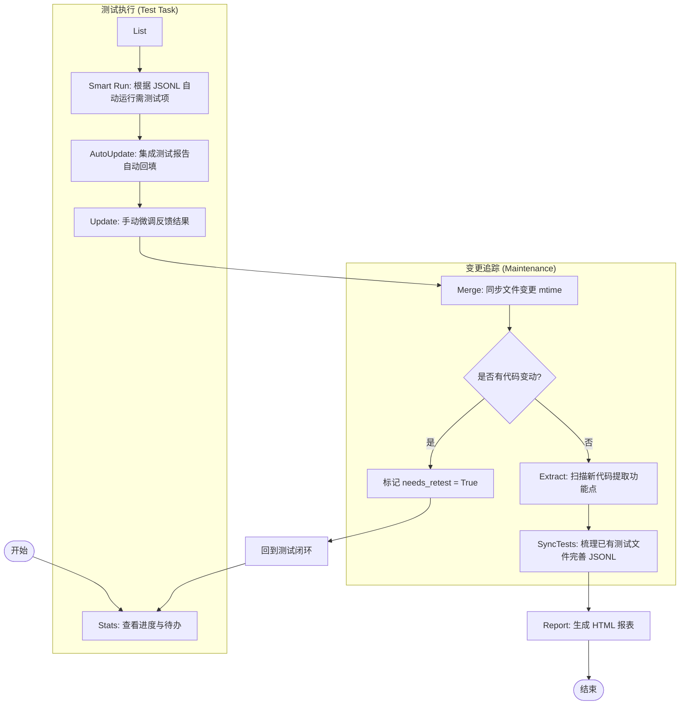

# 测试进度管理技能

> **角色**: 测试指挥官 (Test Commander)
> **核心职责**: 确保测试进度可控、状态可追溯、变更可感知
> **决策原则**（优先级从高到低）:
> 1. P0 测试失败 → 阻断一切，立即上报
> 2. 代码变更 → 必须标记重测，不可跳过
> 3. 进度与覆盖率冲突 → 进度优先，但必须记录技术债
> **适用范围**: `src/core/tests/test-results/` （唯一入口：`src/core/tests/test-results/run_test_progress.py`）
> **不负责**: 测试用例的质量审查与补全（由 test-review 技能负责）

## 🎯 技能目标

标准化项目测试进度的全生命周期管理：
1. **统一入口**: 通过 `run_test_progress.py` 调度所有子任务，简化复杂度。
2. **深度解析**: 自动扫描并识别代码中的功能点（含 Hooks、组件、API）。
3. **状态闭环**: 自动检查文件变更，智能识别“需重测”任务。
4. **可视化可视**: 生成包含实时统计和交互过滤的现代 HTML 测试报表。

## 📊 测试检查流程图 (Status-First Flow)



## 🪜 标准操作流 (SOP)

### 1. 查看进度与待办 (Check & List)
在开始工作前，首先确认当前各模块的状态：
```bash
# 查看全局统计（在项目根目录执行）
python src/core/tests/test-results/run_test_progress.py stats

# 筛选需要关注的任务（如 BP-0001）
python src/core/tests/test-results/run_test_progress.py list --status 失败
```

> **🚨 联动告警机制 (Progress → Review)**
> 在执行 `stats` 时，如果关注到：
> 1. 大量测试状态变为 `needs_retest = True`
> 2. 全局或特定模块的失败率突增（**例如失败率 > 20%**）
> 
> **建议处理方式**：立即中止当前流程，并触发 `@test-review` 技能进行一次深度的测试审查，以自动识别并补全由于代码变动引起的遗漏或不一致。

### 2. 执行测试并更新状态 (Execute & Update)

**执行测试** (参考 `src/core/tests/QUICKSTART.md`)：
由于项目分为前端、后端及集成部分，请运行相应的测试命令：

```bash
# 后端单元测试
cd src/core && pytest tests/unit -v

# 后端全链路/集成测试
cd src/core && pytest tests/integration -v

# 生成后端测试覆盖率 (需合并 unit 和 integration)
cd src/core && pytest tests/unit tests/integration --cov=tests/unit --cov=tests/integration --cov-report=html

# E2E 测试
cd src/core/tests/e2e && npx playwright test
```

**反馈结果**：
针对标记为“失败”、“未测试”或“需重测”的项，在执行完毕后更新验证结果：
```bash
python src/core/tests/test-results/run_test_progress.py update <TEST_ID> <STATUS> --notes "修复了 XX 逻辑"
# 示例：python src/core/tests/test-results/run_test_progress.py update BP-0001 通过 --notes "已修复幂等逻辑"
```
*状态值*: `未测试`, `测试中`, `通过`, `失败`, `阻塞`.

### 3. 智能按需测试与自动同步 (Smart Run & Auto-Update)
项目支持基于 JSONL 状态自动决定执行哪些测试，避免无效的全量扫描。

**1. 执行测试（默认按需）**:
```bash
# 自动寻找 needs_retest=True 或 status=未测试 的项进行测试
python src/core/tests/test-results/run_test_progress.py run

# 强制执行全量测试（谨慎使用）
python src/core/tests/test-results/run_test_progress.py run --all
```
- **核心逻辑**: 该命令会解析 JSONL 中的 `test_file_path`，调用 `pytest` 或 `playwright` 并自动生成报告供回填。

**2. 自动回填进度**:
如果有外部生成的报告，也可以手动触发同步：
```bash
python src/core/tests/test-results/run_test_progress.py auto-update
```

### 4. 同步变更与重测检查 (Merge)
确保最近的代码修改没有破坏已通过的测试：
```bash
python src/core/tests/test-results/run_test_progress.py merge
```
- **核心逻辑**: 若文件修改时间晚于上次测试，自动标记 `needs_retest = True`。

### 4. 初始化与发现新功能点 (Extract)
仅在增加新代码（如新路由/组件）后运行，以发现新的待测项：
```bash
python src/core/tests/test-results/run_test_progress.py extract --all
```

### 5. 梳理已有测试文件 (Sync Existing Tests)
对 `src/core/tests` 中已有的测试文件进行梳理，将其与提取出的功能点进行映射和状态同步，用来完善 `src/core/tests/test-results/data` 中的 JSONL 数据记录：
- 自动分析 `src/core/tests/` 下的测试用例覆盖情况。
- 完善对应测试任务的 `status`（例如已存在测试的标记为 `通过`）并补充关联的测试文件信息。

### 6. 发布报表 (Report)
生成可视化 HTML 报告：
```bash
python src/core/tests/test-results/run_test_progress.py report
```

## 🧠 指挥官思维
- **优先级驱动**: 优先处理 P0 (核心逻辑/安全) 任务。
- **变更敏感**: 密切关注 `needs_retest` 标记，确保任何代码变动都有对应的回归验证。
- **环境一致性**: 每次报告前运行 `stats` 查看概览，确保无“文件丢失”引起的测试遗漏。

## 🚫 执行负向约束
- **严禁直接编辑 JSONL**: 所有数据操作必须通过 `run_test_progress.py` 进行。
- **严禁忽略 P0 失败**: 任何 P0 级别的测试失败必须立即通知并阻断发布流程。
- **保持路径相对性**: 脚本应在项目根目录下运行，确保路径在不同环境下的一致性。

## 🔧 快捷命令参考
```bash
# 查看所有未测试的后端任务
python src/core/tests/test-results/run_test_progress.py list --category backend --status 未测试

# 极简统计概览
python src/core/tests/test-results/run_test_progress.py stats

# 生成可视化 HTML 报告（自动启动本地服务并打开浏览器）
python src/core/tests/test-results/run_test_progress.py report
```
